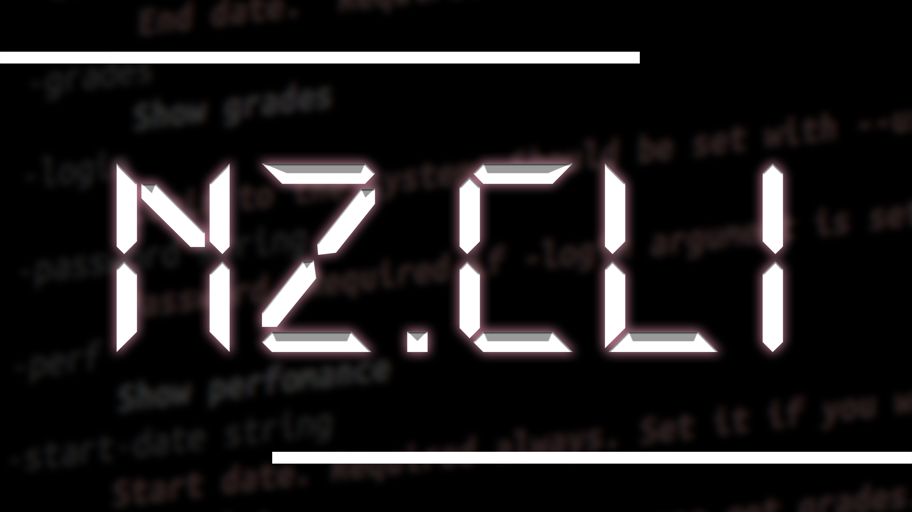

# NZ.CLI


> This client mainly made for my purpose, so I don't use large part of their API (I just don't need it). I'm developing it just for checking marks and homework without exiting terminal or switching to browser.

 *P.S. I plan to add TUI and other **endpoints** (generally, for getting notifications)*

## What it is?
**NZ.CLI** - Minimal Go client for **NZ.UA**. **Main goal**: fast receiving needed information in short format.

*Actually, only a few arguments are supported (their number will be a bit increased in the future)*
## CLI Arguments
### Main
I'd like to specify that each of following parameters requires arguments `-start-date` and `-end-date` (otherwise, today's date will be used).
- `-diary` - fetch homework starting from *start-date* to *end-date*.
- `-perf` - fetch grades to every subject and **correct** semester mark (because nz.ua calculates average including every mark, not only end-of-unit assessment)
- `-grades` - fetch grades of specific subject (requires set `-subject-id`)
### Additional
- `-subject-id` - **ID of subject in system**. **NOTE**:I don't know if it is identical for everyone at the moment, so I can't make easier method.
- `-start-date` - **Start date**. Format `YYYY-MM-DD`.
- `-end-date` - **End date**. Format `YYYY-MM-DD`.
*You can get all possible arguments using parameter `-help` because this documentation can be updated a bit later unlike code (especially its English version).*
## Build
### Prerequisites
- Installed **Go 1.23+** (*recommended*)
### Build (for Windows)
- **Clone repo** with `git clone https://github.com/TechAngle/nz-cli`.
- **Navigate** to the directory `cd nz-cli`.
- **Build** with (*Windows*):
```powershell
go build ./cmd/nz
```
## LICENSE
***NZ.CLI is under MIT license.***
